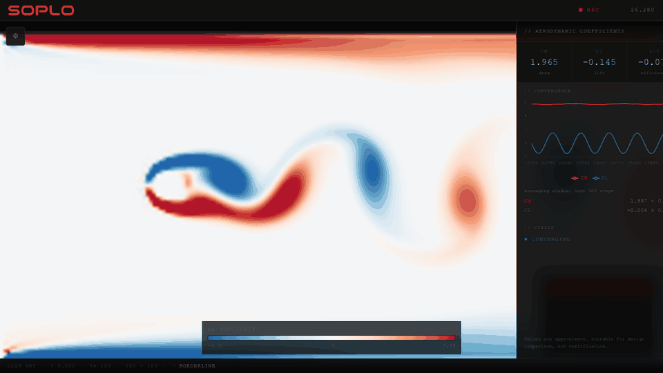

# SOPLO

[](https://github.com/a-alvaro/soplo/actions/workflows/ci.yml)

**An open-source, browser-based 2D fluid dynamics playground built to help you
*understand* fluid mechanics — not just watch pretty colors.**

*Soplo* is Spanish for "puff" or "blow" — the breath of air that starts everything.

> The wind tunnel you wish you had before (and during) your first fluid
> mechanics course.

**[Try SOPLO in your browser](https://soplo.alx.engineering/)** — no install or
account required.



## What it does

You describe a problem in **real physical units** (meters, m/s, air or water),
place a cylinder, a square, a NACA airfoil, or your own SVG/DXF geometry in the
flow, and SOPLO runs a Lattice-Boltzmann simulation live in your browser while it:

- shows you the flow — velocity fields, vorticity, smoke-line streamlines;
- measures aerodynamic forces (Cd, Cl, L/D) and classifies their convergence
  (converging / oscillating / unstable);
- **tells you when to trust the numbers and when not to** — a Reynolds/τ/Mach
  safety indicator and blockage warnings, with the actual limits surfaced;
- and (this is where it's headed) **explains what you are looking at** in plain
  language.

Most web LBM demos give you sliders in lattice units that mean nothing
physically, let you simulate garbage without warning, and show colors without
explanation. SOPLO's whole identity is closing those three gaps: real units,
physical honesty, and interpretation.

## What it is NOT

- **Not** a replacement for OpenFOAM, ANSYS, or any engineering-grade CFD tool.
- **Not** 3D, not compressible, not turbulence-model-based. It is 2D
  incompressible LBM with an honest Reynolds ceiling (≈ 3,500 with the current
  MRT scheme at typical grid sizes) — and it tells you when you exceed it.
- **Not** engineering-grade CFD. Within its documented scope, however, the
  solver is validated: Poiseuille and the Re = 100 cylinder pass their
  literature gates; the Re = 20 cylinder is reported as a converged known
  limitation with a loose regression bound. See [`VALIDATION.md`](./VALIDATION.md)
  for the setups, measurements and caveats.

## Running locally

Requirements: [Node.js](https://nodejs.org/) ≥ 20 and npm.

```bash
git clone https://github.com/a-alvaro/soplo.git
cd soplo
npm install
npm run dev     # Vite dev server, prints a local URL
```

`npm run build` type-checks and produces a production build in `dist/`.

## Tech stack

- **React 19 + TypeScript + Vite + Tailwind CSS 4**, recharts for plots.
- Custom **D2Q9 MRT** Lattice-Boltzmann solver in plain TypeScript, running in a
  dedicated Web Worker and rendered with Canvas2D (no WebGL/GPU yet — a WebGPU
  solver is on the v2 horizon).
- The solver (`src/lbm/`) is pure and headless: no React, no DOM, runnable in
  Node.

## Current state

**Implemented and working:**

- MRT collision (d'Humières basis) with tuned ghost-mode relaxation, stable to
  roughly 3–4× the Reynolds number of plain BGK.
- Half-way bounce-back on arbitrary solids; Zou–He velocity inlet and pressure
  outlet; no-slip side walls by default and free-slip walls for canonical
  cylinder benchmarks.
- Physical → lattice unit conversion with τ clamping and a warning system.
- Momentum-exchange (Ladd) force measurement; live Cd/Cl/L/D with convergence
  classification.
- Geometries: cylinder, square, parametric NACA 4-digit airfoils, SVG import,
  DXF import.
- Auto-sized free-flow domain with blockage warnings. Manual/SVG wind-tunnel
  logic exists in the codebase, but its mode toggle is currently hidden.
- Smoke-line streamline renderer; field rendering (|u|, ux, uy, vorticity).
- Safety indicator (Re/τ/Ma), educational popovers, perturbation injection to
  seed vortex streets.
- Headless invariant and boundary-contract tests, canonical benchmark records,
  and fast CI on Node 20 and 24.
- In-app Strouhal measurement from the Cl history, validated against the BM-3
  solver trace and annotated honestly for confined cylinder setups.
- Dedicated Web Worker execution keeps solver stepping, force/spectral analysis
  and full-field scans off the browser main thread while Canvas2D receives
  transferred snapshots.

**Not there yet (the roadmap):**

- **Interpretation layer** — contextual "what am I seeing?" explanations,
  canvas annotations (stagnation point, wake, separation), and a glossary.
- **Guided experiments** — JSON-preset lessons (vortex shedding vs. Re, angle
  of attack on an airfoil, blunt vs. streamlined bodies).

See [`PROJECT_CONTEXT.md`](./PROJECT_CONTEXT.md) for the full vision, roadmap
and decision log, and [`AGENTS.md`](./AGENTS.md) for the rules AI coding agents
follow in this repo.

## License

[MIT](./LICENSE) © 2026 Alex Álvaro
